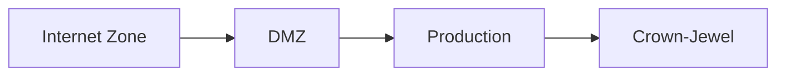

# Diagrams

This directory contains reusable architecture and data-flow diagrams for the public technical residency site.

The purpose is to maintain shared diagram sources in one location so project pages can reference the same artifact rather than recreating equivalent diagrams in multiple files.

## Intended Use

Use this directory for diagrams that are:

- referenced from more than one page;
- part of a project’s stable architecture;
- useful as standalone portfolio artifacts;
- maintained independently from a single Markdown page;
- safe for public publication.

Examples include:

- top-level MockCo enterprise architecture;
- Public Member Portal data flow;
- Security Operations Platform collection and correlation flow;
- LogQ event-ingestion architecture;
- current-state and target-state comparisons;
- trust-boundary and deployment-zone diagrams.

## Directory Structure

Recommended structure:

```text
assets/
└── diagrams/
    ├── README.md
    ├── mockco/
    │   ├── enterprise-architecture.mmd
    │   ├── enterprise-architecture.svg
    │   ├── member-portal-data-flow.mmd
    │   ├── member-portal-data-flow.svg
    │   ├── security-operations-platform.mmd
    │   └── security-operations-platform.svg
    ├── agentic-development/
    │   ├── logq-event-flow.mmd
    │   └── logq-event-flow.svg
    └── appsec-dvwa/
        ├── remediation-lifecycle.mmd
        └── remediation-lifecycle.svg
```

Use project subdirectories once the number of diagrams becomes large enough that a flat directory is difficult to navigate.

## Source and Rendered Files

Mermaid source files should use:

```text
.mmd
```

Rendered public artifacts should preferably use:

```text
.svg
```

PNG may be used when SVG is unsuitable, but SVG is preferred because it:

- scales cleanly;
- remains readable on high-resolution displays;
- works well for architecture diagrams;
- usually produces smaller files than raster images;
- can be linked or embedded directly in Markdown.

Recommended file pair:

```text
enterprise-architecture.mmd
enterprise-architecture.svg
```

The Mermaid file is the editable source.

The SVG file is the artifact referenced by public pages.

## Naming Convention

Use lowercase kebab-case filenames.

Recommended pattern:

```text
<project>-<subject>-<view>.<extension>
```

Examples:

```text
mockco-enterprise-architecture.mmd
mockco-enterprise-architecture.svg
mockco-member-portal-data-flow.mmd
mockco-security-operations-platform.mmd
agentic-development-logq-event-flow.mmd
appsec-dvwa-remediation-lifecycle.mmd
```

Within project subdirectories, the project prefix may be omitted:

```text
mockco/
  enterprise-architecture.mmd
  member-portal-data-flow.mmd
```

Use stable names. Avoid version suffixes such as:

```text
diagram-final-v2-revised.svg
```

When a diagram changes, update the existing source and rendered artifact unless the previous version has historical value.

## Referencing Diagrams

Reference rendered files from Markdown pages using repository-relative paths.

Example from:

```text
projects/mockco/index.md
```

```markdown

```

Example with a caption:

```markdown
<figure>
  
  <figcaption>
    MockCo enterprise architecture and major trust boundaries.
  </figcaption>
</figure>
```

Use root-relative URLs beginning with `/assets/` so diagrams can be referenced consistently from pages at different directory depths.

## Mermaid Source Example



Save source-only Mermaid content in the `.mmd` file:

```text
flowchart LR
    Internet["Internet Zone"]
    DMZ["DMZ"]
    Production["Production"]
    CrownJewel["Crown-Jewel"]

    Internet --> DMZ
    DMZ --> Production
    Production --> CrownJewel
```

Do not include the surrounding Markdown code fence in the `.mmd` source file.

## Reuse Rules

A shared diagram should have one authoritative source file.

When multiple pages need the same architecture view:

1. update the source in this directory;
2. regenerate the rendered artifact;
3. reference the same rendered file from each page.

Avoid copying Mermaid source into multiple project pages unless the diagram is intentionally page-specific.

This reduces drift between documents and keeps the architecture representation consistent.

## Diagram Scope

Each diagram should answer one clear question.

Examples:

- What are the major MockCo trust zones?
- How does member traffic reach Production services?
- How does SecApp collect and correlate inventory and vulnerability data?
- How does a LogQ event move from agent emission to a completed segment?
- Which components exist in the current state versus the target state?

Large diagrams should be split when they attempt to show:

- deployment topology;
- application internals;
- data flow;
- identity;
- encryption;
- operational ownership;
- implementation status;

all in one view.

Prefer several focused diagrams over one dense diagram that is difficult to interpret.

## Current-State and Target-State Diagrams

Clearly label whether a diagram represents:

```text
Current state
Target state
Conceptual design
Planned direction
Historical state
```

Do not present planned components as implemented.

Recommended title pattern:

```text
MockCo Enterprise Architecture — Current State
MockCo Enterprise Architecture — Target State
```

Where current and target states appear in one diagram, use explicit grouping and a legend.

## Trust Boundaries

Trust boundaries should be visually explicit.

For MockCo diagrams, common zones include:

```text
Internet
DMZ
Production
Crown-Jewel
Internal User or Endpoint
```

Use containers, subgraphs, labels, or boundary lines to show which components belong to each zone.

A component should not appear ambiguously between zones.

Data-flow arrows should indicate direction and, where useful:

- initiation direction;
- protocol or interface;
- data classification;
- encryption state;
- retrieval versus push behavior;
- prohibited paths.

## Security and Publication Rules

Before publishing a diagram, verify that it contains no:

- real credentials;
- secrets or tokens;
- private keys;
- production hostnames;
- public IP addresses tied to real environments;
- internal employer or client names;
- confidential system names;
- real customer identifiers;
- real PHI, PII, or payment data;
- production network topology;
- production security-control details;
- private repository paths that should not be disclosed.

Use synthetic names, generalized labels, and intentionally simplified flows.

Diagrams should describe the portfolio projects rather than resemble copied enterprise documentation.

## Accuracy Standard

A diagram should match the current project documentation.

Before updating or publishing a diagram, verify:

- component names;
- trust-zone ownership;
- data-flow direction;
- implemented versus planned status;
- service boundaries;
- persistence ownership;
- security assumptions;
- page links that reference the diagram.

Architecture diagrams become misleading quickly when they remain unchanged while the implementation evolves.

Update the diagram or label it as historical.

## Accessibility

Every embedded diagram should include meaningful alternative text.

Good:

```markdown

```

Weak:

```markdown

```

For complex diagrams, include a short text explanation immediately before or after the image.

The written explanation should allow a reader to understand the primary architecture without relying entirely on the graphic.

## Visual Style

Use the portfolio color scheme consistently:

```text
Black:  #111111
Red:    #800000
White:  #FFFFFF
Gray:   restrained supporting use
```

Recommended use:

- black for text and primary lines;
- red for trust boundaries, emphasis, warnings, or key flows;
- white for backgrounds;
- gray for secondary components and annotations.

Use red selectively so it continues to communicate meaning.

Avoid assigning colors without a legend when color implies status, risk, trust level, or ownership.

## Diagram Inventory

Maintain this table as diagrams are added.

| Diagram | Source | Rendered artifact | Status | Primary pages |
|---|---|---|---|---|
| MockCo enterprise architecture | `mockco/enterprise-architecture.mmd` | `mockco/enterprise-architecture.svg` | Planned | MockCo overview, architecture |
| Member Portal data flow | `mockco/member-portal-data-flow.mmd` | `mockco/member-portal-data-flow.svg` | Planned | MockCo architecture, Member Portal |
| Security Operations Platform flow | `mockco/security-operations-platform.mmd` | `mockco/security-operations-platform.svg` | Planned | MockCo architecture, Security Operations Platform |
| LogQ event flow | `agentic-development/logq-event-flow.mmd` | `agentic-development/logq-event-flow.svg` | Planned | Agentic Development overview, LogQ |
| DVWA remediation lifecycle | `appsec-dvwa/remediation-lifecycle.mmd` | `appsec-dvwa/remediation-lifecycle.svg` | Planned | AppSec DVWA overview, lab method |

Update `Status` using values such as:

```text
Planned
Draft
Current
Historical
Deprecated
```

## Recommended Initial Diagrams

The first diagrams to publish should be:

1. MockCo enterprise architecture.
2. Public Member Portal data flow.
3. Security Operations Platform collection and correlation flow.
4. LogQ event-ingestion flow.
5. DVWA remediation lifecycle.

These provide the clearest reusable visual foundation for the current portfolio.