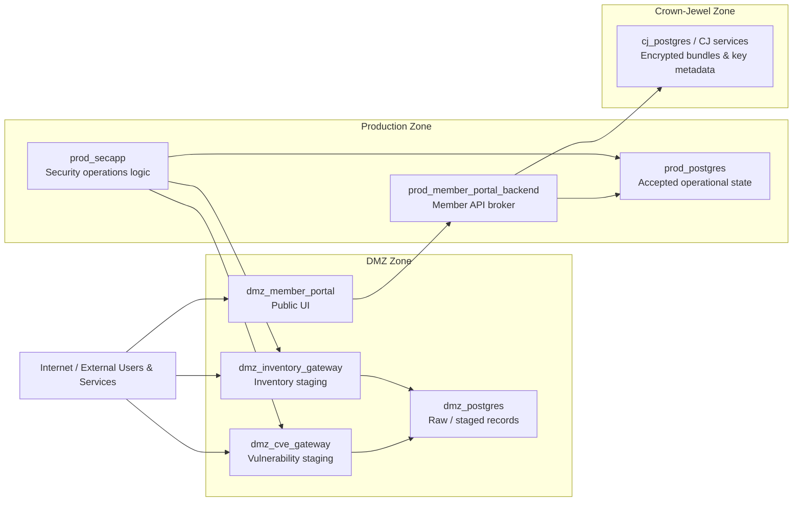

MockCo uses a zone-based architecture to make trust boundaries explicit. The current design centers on Internet, DMZ, Production, and Crown-Jewel zones, with future room for intranet/internal-user context and cloud-specific deployment patterns.

The architecture is intentionally security-first. MockCo starts from adversary impact scenarios and then works backward into system boundaries, data movement, persistence, encryption, and operational workflows.

## Architecture Thesis

The central architecture principle is:

> Higher-trust systems should control when and how they retrieve, validate, accept, and persist data from lower-trust systems.

That principle appears in two different ways:

1. The Public Member Portal uses a DMZ presentation layer, a Production broker/backend, and Crown-Jewel protected storage for sensitive member data.
2. The Security Operations Platform stages externally influenced data in the DMZ, but Production owns acceptance, normalization, correlation, and analyst-facing operational truth.

The architecture does not assume that a firewall or network segment alone makes data safe. Data becomes trusted only after it has passed through an explicit validation and acceptance path.

## Primary Zones

| Zone | Purpose | Examples |
|---|---|---|
| Internet / External | Untrusted users, browsers, external services, and simulated external endpoints. | Member browser, untrusted endpoint simulator, external vulnerability intelligence source. |
| DMZ | Public-facing presentation and controlled intake/staging. | Public member portal UI, CVE gateway, inventory gateway, DMZ staging database. |
| Production | Business logic, orchestration, accepted operational state, internal APIs, and analyst workflows. | Member portal backend, security application backend, Production databases, internal analyst portal. |
| Crown-Jewel | Highest-sensitivity protected data and key metadata. | Encrypted member bundles, wrapped DEKs, key metadata, recovery grants, sensitive document references. |

The Crown-Jewel zone is not defined merely by database importance. It is defined by the sensitivity and blast-radius impact of the data it protects.

## High-Level Zone Model

This diagram is conceptual. Exact routes, APIs, and service names may change between MockCo versions.

## Boundary Rules

MockCo uses a few recurring boundary rules:

1. DMZ services must not write directly to Production data stores.
2. Production services must not directly query DMZ databases.
3. Public or endpoint-originated data is untrusted until validated and accepted by Production logic.
4. Crown-Jewel services must not be directly reachable from the public internet, DMZ, or untrusted endpoints.
5. Production access to Crown-Jewel infrastructure does not imply routine plaintext access to protected member data.
6. Public API responses should use stable public references rather than internal database identifiers.
7. Sensitive document bytes, plaintext DEKs, private keys, production credentials, and real PHI/PII must not be stored in lab repositories or application databases.

## Security-First Design Position

MockCo intentionally begins with security and breach-impact questions before convenience questions.

For example:

- What happens if a DMZ component is compromised?
- What happens if the Production database is dumped?
- What happens if an attacker obtains staged vulnerability or endpoint inventory records?
- What happens if an analyst account is misused?
- What happens if the user endpoint is compromised?
- Which compromise creates individual-user exposure, and which compromise creates population-level exposure?

The architecture is then shaped to reduce catastrophic blast radius.

## Sensitive Data Posture

The strongest sensitive-data design goal is that highly sensitive member data should not exist as routine plaintext even in Crown-Jewel persistence.

Instead, sensitive data should be represented through:

- encrypted bundles;
- wrapped data-encryption keys;
- key metadata;
- recipient or device key references;
- recovery grants;
- audited access paths;
- controlled re-wrapping workflows.

This does not eliminate risk. It moves and narrows risk.

A compromised user endpoint may still expose that user's active plaintext. A flawed recovery process may still become dangerous. A compromised broker may still retrieve encrypted material improperly if authorization fails. Those risks require their own controls.

But the architecture aims to avoid one of the worst outcomes: a single database compromise exposing all sensitive member records in plaintext.

## Current vs. Target-State Framing

MockCo has been rebuilt several times. The most complete implementation state and the current target architecture are not always the same thing.

| Area | Most mature prior state | Current target direction |
|---|---|---|
| Public Member Portal | Early UI/backend concepts and prototype flows. | DMZ UI, Production broker, Crown-Jewel encrypted bundles, browser-side plaintext boundary. |
| Security Operations | Internal security tooling concept and architecture. | Exposure management platform with DMZ staging, Production promotion, correlation, and analyst triage. |
| Architecture Documentation | Evolved across conversations and design docs. | Public-safe architecture pages with concise diagrams and explicit limitations. |
| Identity | Mostly conceptual / deferred. | Account-user, member-subject, session, trusted-device, and delegated-access model. |
| Key Management | Conceptual encrypted-bundle and wrapped-DEK model. | Stronger key-management and recovery design before deeper implementation. |
| Cloud Deployment | Planned. | GCP deployment path for VPC, IAM, network segmentation, and infrastructure-as-code practice. |

## Design Choices Being Tested

MockCo is meant to test several architectural choices:

### Trust-boundary-first service design

Instead of allowing low-trust components to push directly into high-trust data stores, Production systems should retrieve, validate, and accept data through explicit paths.

### Source-of-truth discipline

DMZ staging data is not Production truth. Endpoint inventory is not automatically trusted. External vulnerability intelligence is not automatically actionable. Accepted Production state must have validation, normalization, and traceability.

### Crown-Jewel isolation

Sensitive member data should be isolated not only by network placement, but by persistence model and cryptographic design. The Crown-Jewel zone should not become a convenient plaintext data lake.

### Public / internal identifier separation

Public-facing APIs should not expose raw database row IDs or Crown-Jewel internal identifiers. Public references should be stable, scoped, and checked through authorization logic.

### Auditability as architecture

Audit is not only a logging concern. It affects API design, mutation workflows, recovery design, administrative actions, and analyst triage decisions.

## Deferred Architecture Questions

Some architecture areas are intentionally deferred.

| Area | Current reason for deferral |
|---|---|
| Full identity provider implementation | Identity is load-bearing and should not be casually bolted on before the account/member/subject model is stable. |
| Full browser-side decrypt implementation | The envelope model exists, but production-quality user key handling, recovery, client storage rules, and browser threat model need more design and testing. |
| Homomorphic analytics | Interesting research direction, but not yet part of the committed build path. |
| Post-quantum-safe design | Worth exploring for learning and future-proofing, but not yet represented as a complete system design. |
| GCP deployment | Planned after local architecture and service boundaries are stable enough to justify cloud translation. |
| Observability platform | Valuable later, once enough services exist to make telemetry and failure modes meaningful. |

## Relationship to Implementation

This page describes architectural intent. Specific implementation details may differ between V0, V1, V2, and future rebuilds.

That is intentional. The public architecture should describe the design principles and tradeoffs that survive rebuilds. Exact APIs, file paths, and service names can change as the system becomes more concrete.