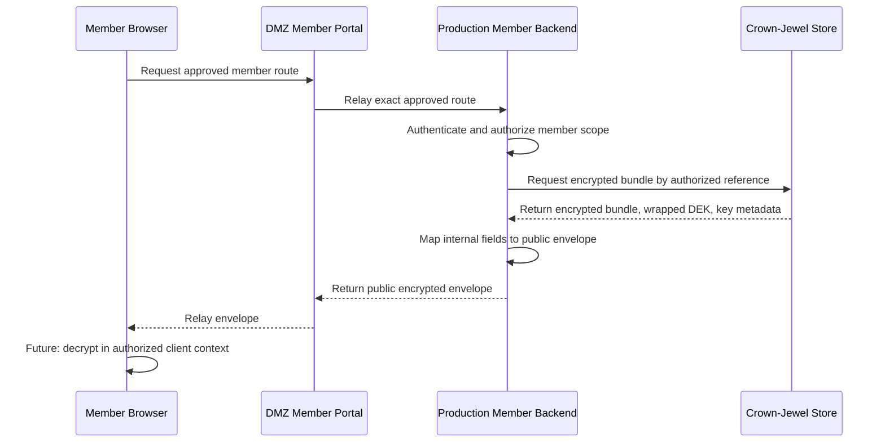

The MockCo Public Member Portal is the customer-facing application for the synthetic health-insurance enterprise. It is designed to handle sensitive member data while preserving strict boundaries between the public UI, Production application logic, and Crown-Jewel protected storage.

The design goal is not simply to make a working portal. The goal is to explore what a member-facing application looks like when sensitive-data protection is treated as a primary architecture constraint.

## Design Goal

The Member Portal tests this question:

> How should a customer-facing healthcare or insurance application handle sensitive member data if the enterprise wants to minimize the blast radius of database compromise?

The current design uses:

- a DMZ-hosted presentation tier;
- a Production-hosted member portal backend;
- a Production metadata database;
- a Crown-Jewel encrypted data store;
- encrypted bundles for highly sensitive member content;
- wrapped data-encryption keys;
- a future browser-side plaintext boundary for authorized users.

## Component Model

| Component | Zone | Responsibility |
|---|---|---|
| Member browser | Internet / External | Renders UI and eventually decrypts approved sensitive data in authorized session/device context. |
| `dmz_member_portal` | DMZ | Serves static UI and relays only explicitly approved member portal routes. |
| `prod_member_portal_backend` | Production | Authenticates, authorizes, aggregates metadata, brokers protected bundle access, writes audit events. |
| `prod_member_portal_postgres` | Production | Stores operational metadata, public references, workflow state, and non-sensitive summaries. |
| Crown-Jewel storage / services | Crown-Jewel | Stores encrypted bundles, wrapped DEKs, key metadata, recovery grants, and protected artifact references. |

The DMZ tier should not hold authoritative business state. It should not decrypt sensitive member data. It should not expose a generic proxy into Production or Crown-Jewel systems.

## Sensitive Data Posture

The strongest design position is that highly sensitive member data should not be stored as convenience plaintext, even in the Crown-Jewel database.

Instead, sensitive member data should be stored as encrypted material with separately managed key metadata.

That means a protected data record is closer to:

- encrypted payload;
- nonce and authentication tag;
- associated-data metadata;
- bundle reference;
- member subject reference;
- key metadata reference;
- wrapped DEK;
- recipient key reference;
- expiration and cache policy;
- audit metadata.

It is not simply:

- `member_profile` table with plaintext sensitive fields;
- `claims` table with all sensitive claim details in plaintext;
- document bytes in the application database;
- one enterprise key that can decrypt everything routinely.

## Encrypted Bundle Flow

The Production backend brokers and maps the envelope. It should not routinely decrypt protected member data.

The browser may become the plaintext boundary for an authorized member. That creates endpoint-specific risk, but it avoids turning enterprise-side databases into large plaintext exposure points.

## Design Concepts Demonstrated

The Member Portal is meant to demonstrate several technical concepts.

| Concept | What the design is testing |
|---|---|
| DMZ presentation boundary | Public UI can exist in the DMZ without becoming an authoritative data store. |
| Production broker pattern | Production can authenticate, authorize, orchestrate, and map data without routinely decrypting protected content. |
| Crown-Jewel encrypted storage | High-sensitivity data can be stored as encrypted bundles and key metadata, not plaintext convenience records. |
| Browser-side plaintext boundary | Authorized plaintext can be scoped to the user/device context rather than broad enterprise backend access. |
| Public/internal identifier separation | Public API references should not expose raw database IDs or Crown-Jewel internal row identifiers. |
| Recovery as exception | Recovery and re-wrapping should be time-bound, audited, and exceptional rather than a standing enterprise decrypt capability. |
| Data minimization by endpoint | Each route should return only the data required for that workflow. |

## Current Status

| Area | Status | Notes |
|---|---|---|
| Member portal concept | Designed | The split-zone model is stable: DMZ UI, Production backend, Production metadata, Crown-Jewel encrypted data. |
| Dashboard / coverage / claims / documents | Designed / partially prototyped | Basic read-heavy workflows are defined. Exact APIs may change between MockCo versions. |
| Encrypted bundle model | Designed | The envelope contract and broker pattern are central to the design. |
| Browser-side decrypt | Deferred implementation | The intended plaintext boundary is clear, but user key handling, recovery, storage rules, and browser threat model need deeper work. |
| Authentication and sessions | Deferred / design-first | Identity is load-bearing and should not be casually bolted onto the portal. |
| Recovery authority | Conceptual | Recovery should support re-wrapping and account restoration without becoming a broad decryptor. |
| Document uploads | Designed for later | Upload requires validation, malware scanning, object storage, encryption, and audit design before implementation. |
| Billing and payments | Designed for later | Payment workflows should use tokenized references only; no raw card data in MockCo systems. |
| Member-directed sharing | Future design | Grant metadata can be modeled first; proxy re-encryption or similar models remain future research. |

## Intended Portal Features

The long-term portal feature set includes:

- member authentication and session management;
- member dashboard;
- profile management;
- coverage and benefits;
- claims list and claim detail;
- claims submission or reimbursement request;
- documents center;
- document upload workflow;
- member-directed access sharing;
- account recovery and trusted devices;
- billing and payments;
- member-visible account activity and audit view.

Support case tracking, secure support messaging, callback management, and support attachments are intentionally not part of the current MockCo portal model.

## Data Classification

| Data type | Example | Intended handling |
|---|---|---|
| Static/public content | Generic help text, branding, public notices | DMZ static assets. |
| Operational metadata | Policy status, claim ID, document title, invoice status | Production metadata store, member-scoped API responses. |
| Sensitive member data | Profile details, claim line detail, EOB content, uploaded documents | Crown-Jewel encrypted bundles or encrypted object storage. |
| Cryptographic material | Wrapped DEKs, key metadata, recipient key references | Crown-Jewel / KMS-aligned stores; no plaintext DEKs in API responses or logs. |
| Audit events | Login, document download, profile update, recovery event | Production or Crown-Jewel audit store, member-safe views where appropriate. |
| Payment references | Tokenized payment instrument, receipt, invoice status | Production metadata only; no raw card data. |

## Security Invariants

The Member Portal design should preserve the following invariants:

1. DMZ does not decrypt protected member data.
2. DMZ does not directly access Crown-Jewel systems.
3. Production does not routinely decrypt protected member data.
4. Crown-Jewel stores protected data as encrypted material and key metadata.
5. Public APIs do not expose internal database IDs.
6. Document object bytes are not stored in the member portal API database.
7. No raw card data, private keys, plaintext DEKs, real PHI, real PII, or production credentials are stored in MockCo.
8. Browser storage must not persist plaintext, DEKs, private keys, raw ciphertext, wrapped DEKs, or full sensitive envelopes without explicit design approval.
9. Recovery workflows are audited, time-bound, and exceptional.
10. Authorization is based on account-to-member or grant relationship, not possession of a public reference alone.

## Key Open Questions

### Where should member identity live?

The portal needs account users, member subjects, household/dependent relationships, authorized representatives, sessions, trusted devices, and delegated access. This needs design before serious implementation.

### How much claim detail can safely remain in Production metadata?

Claim headers and status metadata may be acceptable in Production. Detailed claim lines, EOB contents, and sensitive documents likely belong in encrypted protected bundles.

### How should browser-side keys be handled?

The long-term design depends on user/device-held key material. The exact browser key-handling model needs more work, especially around private key protection, device loss, recovery, and avoiding unsafe browser persistence.

### What is the right recovery model?

Recovery should restore legitimate access without giving the enterprise a standing universal decrypt capability. Re-wrapping is preferable to routine backend plaintext access.

### How should analytics work without exposing sensitive data?

Homomorphic encryption or other privacy-preserving methods may be explored later. This is a research direction, not a current implementation claim.

## Relationship to MockCo Architecture

The Member Portal is one application inside MockCo. It should not share the Security Operations Platform's databases, triage workflows, or vulnerability-ingestion trust paths.

The two systems are intentionally different:

- the Member Portal focuses on member-sensitive data and customer-facing workflows;
- the Security Operations Platform focuses on internal vulnerability exposure management.

Both use the same underlying architectural discipline: trust boundaries first, then data movement.