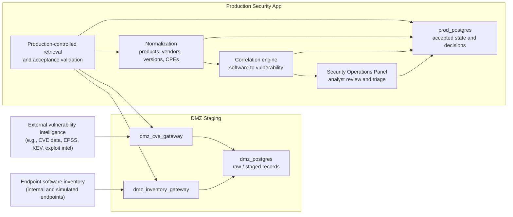
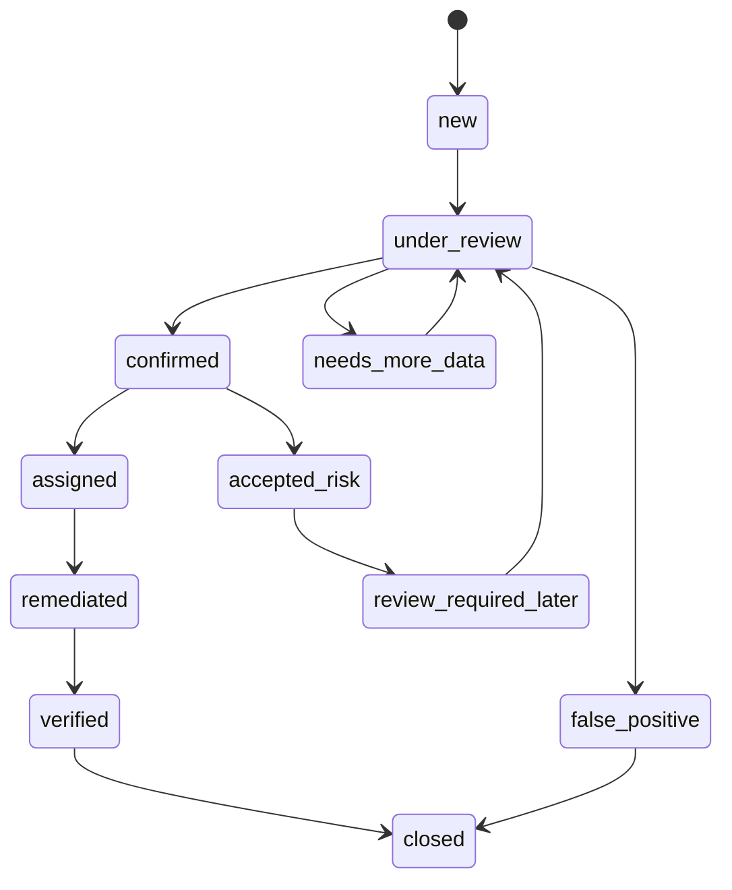

The MockCo Security Operations Platform is the internal security tooling track for the lab. It is intended to model exposure management rather than simple vulnerability scanning.

The platform combines vulnerability intelligence, endpoint software inventory, DMZ staging, Production-controlled promotion, software-to-vulnerability correlation, and analyst triage workflows.

## Design Goal

The Security Operations Platform tests this question:

> How should internal security tooling convert external vulnerability intelligence and endpoint-originated inventory into trusted, explainable, auditable exposure findings?

The goal is not to build a scanner. The goal is to build the kind of internal system a security organization might use to reason about real exposure across endpoints, software, vulnerabilities, and business context.

## Why Exposure Management?

Traditional vulnerability management often starts with scanner findings. MockCo takes a broader view.

The platform should reason across:

- known vulnerabilities;
- affected products and versions;
- endpoint software inventory;
- confidence in software-to-product matching;
- whether an observation is fresh or stale;
- whether a vulnerability is known exploited;
- analyst decisions and exceptions;
- remediation and verification status;
- auditability of triage decisions.

That moves the problem from "find CVEs" to "understand exposure."

## High-Level Flow

The key boundary principle is that DMZ services stage data, but do not directly write trusted Production state.

Production owns retrieval, validation, normalization, correlation, persistence, and analyst-facing workflow.

## Main Components

| Component | Zone | Responsibility |
|---|---|---|
| Endpoint inventory source | Endpoint / external simulation | Reports installed software and environment context. |
| Vulnerability intelligence source | External | Provides vulnerability, product, EPSS, KEV, exploit, or related intelligence. |
| `dmz_inventory_gateway` | DMZ | Receives or stages endpoint-originated inventory observations. |
| `dmz_cve_gateway` | DMZ | Retrieves or stages vulnerability intelligence. |
| `dmz_postgres` | DMZ | Stores raw and staged records. Not authoritative Production truth. |
| `prod_secapp` | Production | Retrieves staged data, validates, normalizes, correlates, and exposes internal APIs. |
| `prod_postgres` | Production | Stores accepted vulnerabilities, inventory, product mappings, findings, triage decisions, and audit metadata. |
| Security Operations Panel | Production internal | Analyst-facing interface for reviewing and triaging exposure findings. |

## Design Concepts Demonstrated

| Concept | What the design is testing |
|---|---|
| DMZ staging | Externally influenced data is staged before becoming trusted operational state. |
| Production-controlled promotion | Higher-trust systems initiate retrieval and acceptance from lower-trust staging. |
| Endpoint inventory modeling | Software observations are treated as evidence with freshness, source, and confidence. |
| Vulnerability intelligence ingestion | External vulnerability data is useful, but not automatically trusted or actionable. |
| Software/product correlation | Observed software must be mapped to products, vendors, CPEs, versions, and affected ranges. |
| Explainable findings | Analysts should see why a finding exists, not just that a CVE matched an endpoint. |
| Triage decision capture | Analyst decisions require status, reason, timestamp, actor, and audit history. |
| Source traceability | Accepted Production records should retain trace references without turning Production into a raw DMZ mirror. |

## Data Trust Lifecycle

The platform distinguishes several states of data:

| State | Meaning |
|---|---|
| Raw | Source payload or endpoint-originated record has been observed but not meaningfully normalized. |
| Staged | DMZ has stored the data and may have performed initial validation or parsing. |
| Retrieved | Production has pulled the staged record through an approved path. |
| Accepted | Production validation has accepted the record into trusted operational state. |
| Rejected / quarantined | Production validation rejected or isolated the record with a reason. |
| Normalized | Data has been mapped into stable product, vendor, endpoint, version, or vulnerability concepts. |
| Correlated | Accepted vulnerability and inventory data have been linked into exposure findings. |
| Triaged | A human analyst or authorized workflow has made a decision on the finding. |
| Remediated / verified / closed | The finding has moved through remediation and verification states. |

This lifecycle matters because external vulnerability data and endpoint-originated inventory are not automatically trusted.

## Correlation Model

The correlation process should eventually answer:

1. Which endpoints exist?
2. What software was observed on each endpoint?
3. How fresh is the observation?
4. What product or CPE does the observed software map to?
5. How confident is that mapping?
6. Which vulnerabilities affect that product and version?
7. Is the vulnerability known exploited, high severity, or otherwise prioritized?
8. Does the finding represent confirmed exposure, possible exposure, stale evidence, or ambiguous evidence?
9. What decision did an analyst make, and why?

A finding should not be a black box. It should preserve enough evidence for an analyst to understand the path from observation to conclusion.

## Security Operations Panel

The analyst-facing panel is a Production internal application. It should show accepted Production state, not raw DMZ database contents.

Expected workflows include:

- dashboard of current exposure;
- finding list and filters;
- finding detail with correlation evidence;
- endpoint inventory review;
- vulnerability record review;
- product/vendor/CPE mapping review;
- triage decision capture;
- accepted-risk and false-positive workflows;
- audit and decision history;
- ingestion and promotion job visibility for authorized users.

The panel is not an ingestion surface. It should not receive external vulnerability data directly. It should not receive endpoint check-ins directly. It should not expose arbitrary analyst SQL access.

## Finding Lifecycle

A possible finding lifecycle is:

The exact lifecycle may change, but the important point is that decisions should be explicit, attributable, and reviewable.

## Current Status

| Area | Status | Notes |
|---|---|---|
| Overall SecOps architecture | Designed | The major trust-boundary pattern is defined: external/endpoint data into DMZ staging, Production retrieval and acceptance, internal analyst review. |
| Vulnerability intelligence source | Designed / planned | External intelligence such as CVE data, product relationships, EPSS, KEV, and exploit intelligence can feed the model. |
| Endpoint inventory collection | Designed / planned | Simulated endpoints should eventually report software inventory into DMZ staging. |
| DMZ staging | Designed | DMZ gateways and staging database model are part of the core architecture. |
| Production promotion | Designed | Production should initiate retrieval and validation rather than accept direct DMZ writes. |
| Correlation engine | Designed conceptually | The model is defined, but exact product/version matching algorithms and schemas may change. |
| Analyst panel | Designed | The Security Operations Panel has a strong design direction, but implementation detail will evolve. |
| Triage workflow | Designed | Decision statuses, reason codes, comments, and auditability are core requirements. |
| Remediation automation | Deferred | The first goal is exposure understanding and triage, not patch orchestration or SOAR. |
| Observability | Planned | Useful once enough services and jobs exist to make telemetry meaningful. |

## Deliberate Non-Goals

The first Security Operations Platform implementation should not try to do everything.

Current non-goals include:

- building a full vulnerability scanner;
- direct endpoint-to-Production writes;
- direct DMZ writes into Production databases;
- analyst access to raw databases;
- broad SOAR automation;
- patch deployment orchestration;
- ticketing integration as a first dependency;
- arbitrary raw payload browsing;
- Crown-Jewel or member PHI workflows;
- HR, claims, or member support workflows.

## Security Design Rules

The platform should preserve these rules:

1. The panel UI calls only Production APIs.
2. The panel UI never calls DMZ gateways directly.
3. Analyst browsers never connect directly to DMZ or Production databases.
4. DMZ gateways do not initiate writes into Production databases.
5. Production stores accepted state, not unreviewed raw DMZ payloads.
6. Source traceability should exist, but Production should not become a mirror of all raw staged data.
7. All consequential triage and administrative actions should produce audit events.
8. Role-based authorization is enforced server-side.
9. Mutation routes require appropriate CSRF or equivalent browser-session protection.
10. List endpoints should support pagination, sorting, filtering, and deterministic ordering.

## Why This Matters

This application is the internal security-tooling counterpart to the Public Member Portal.

The Member Portal asks how to protect sensitive member data from catastrophic disclosure.

The Security Operations Platform asks how to protect the enterprise by understanding its exposure to vulnerabilities across software, endpoints, and time.

Together, they create a useful architecture lab:

- one application handles high-sensitivity customer data;
- the other handles internal operational security data;
- both require trust-boundary discipline;
- both require careful data modeling;
- both expose real design tradeoffs that are easy to hide in smaller toy projects.

## Open Questions

### What is the authoritative endpoint identity model?

Endpoint identity is harder than hostname matching. The design needs a clear model for endpoint IDs, duplicate observations, stale devices, lifecycle states, and confidence.

### How should software normalization work?

Observed software names, versions, vendors, and CPEs are messy. The design needs a defensible approach that preserves ambiguity rather than forcing low-confidence matches.

### How should risk be prioritized?

CVSS, EPSS, CISA KEV, exploit intelligence, asset criticality, exposure context, and inventory freshness can all matter. The first implementation should stay explainable before building a complex scoring system.

### When should findings close automatically?

Automatic closure can be dangerous if inventory freshness is weak. The design should prefer explicit verification until the evidence model is reliable.

### How much raw source context should analysts see?

Analysts need traceability, but broad raw payload access can blur the DMZ/Production boundary. Sanitized previews and opaque trace references may be preferable to raw source browsing.

### How should ticketing integration work?

Ticketing is useful, but it should come after the core exposure model is stable. Otherwise, the ticketing workflow may define the architecture by accident.

## Relationship to MockCo Architecture

The Security Operations Platform is a Production internal security application. It is separate from the Public Member Portal and should not become a PHI access surface.

Its purpose is to model internal exposure management and security operations, not customer-facing healthcare workflows.